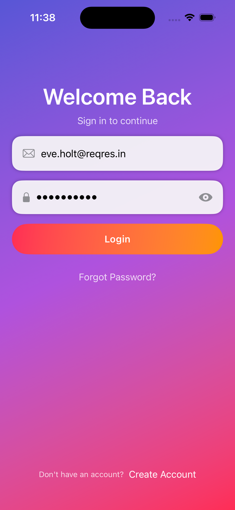
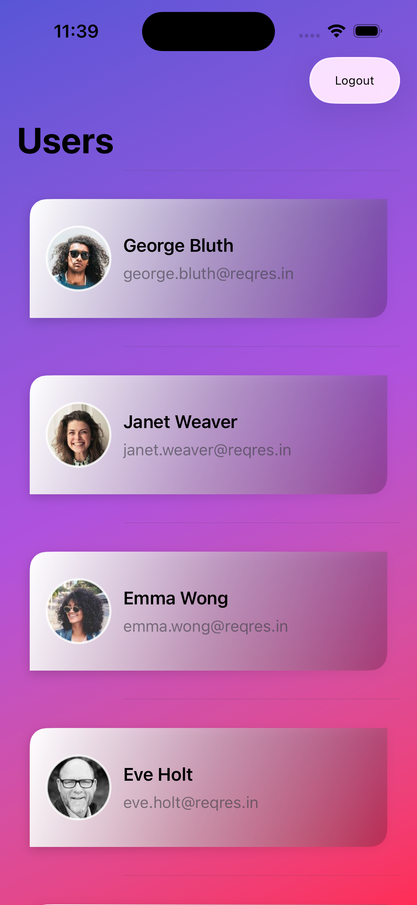
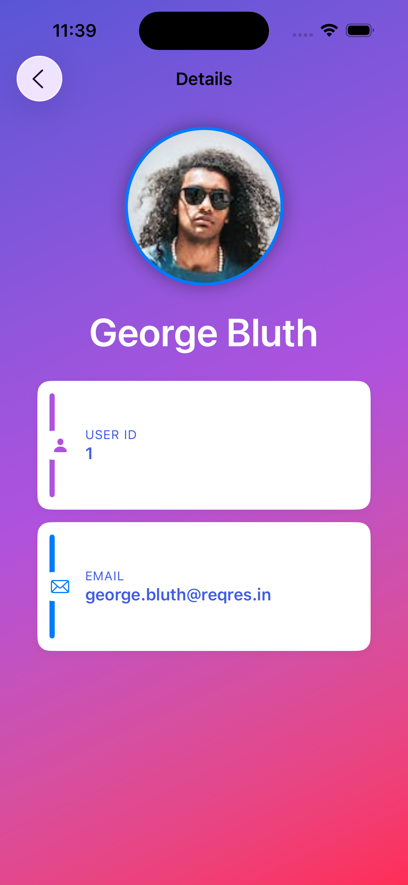
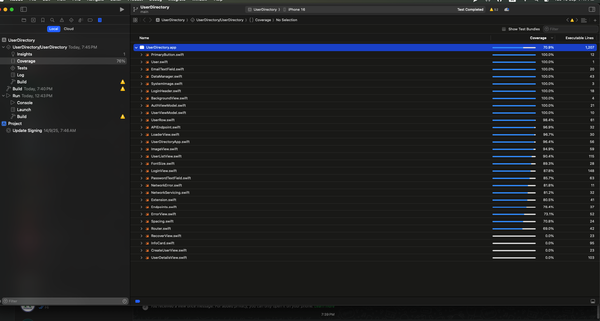

# UserDirectory App

A secure user directory app for internal staff of a delivery company. The app authenticates users, securely stores the session token, fetches the staff list, and displays user details.

---

## 🟢 Overview

UserDirectory allows internal staff to:

- Login securely via a login API  
- Store and retrieve API token in Keychain  
- Fetch and display a list of users with avatars, names, and emails  
- View detailed user information  
- Supports pagination, pull-to-refresh, and caching policies  
- Designed to be compatible with all iOS devices  

---

## ✨ Features

### Login Screen
- Fields: Email, Password  
- Login:
  - Calls login API using Combine  
  - Stores token securely in Keychain  
  - Retrieves token if already saved  
  - Shows error alert on failure  

### Users List Screen
- Fetch users via API  
- Displays:
  - Avatar image  
  - Full name  
  - Email  
- Tap a user to navigate to **User Detail Screen**  
- Pull-to-refresh support  

### User Detail Screen
- Shows larger avatar, full name, email, and user ID  

---

## 🏗 Architecture

- **MVVM (Model-View-ViewModel)** with clean separation of layers  
- **Combine** for network calls and state management  
- **SwiftUI** for UI  
- **Router** for navigation between Auth and Home flows  
- **Reusable Networking Layer** with loose coupling  
- **Keychain** for secure token storage  
- Supports dynamic font sizes  
- App caching policy implemented  

---

## 🛠 Technologies Used

- Swift 5  
- SwiftUI  
- Combine  

---

## 📸 Screenshots

### App Screens
#### Login Screen
  

#### Users List Screen
  

#### User Detail Screen
  

### Test Coverage
- **Current Code Coverage: 76%**
  

---

## 🧪 Testing & Coverage

- Unit tests for networking, view models, and authentication flow  
- Tests include:
  - Network requests with mock responses  
  - ViewModel state management  
  - Token storage & retrieval  
- Coverage is continuously improving; new features are being added  

---

## 🔮 Future Improvements

- Working on incease unit test coverage.

---
